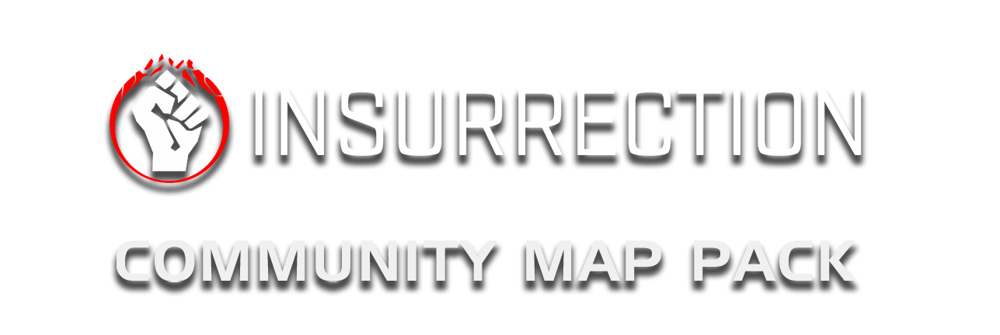
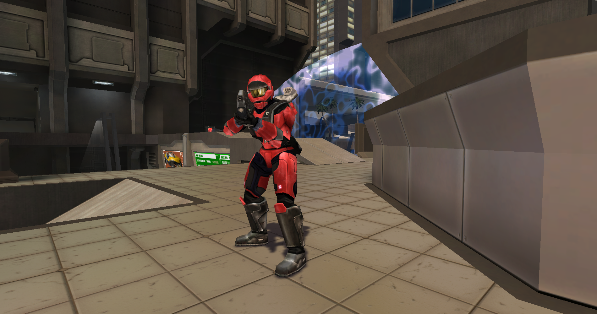

<html>
    

        
    

    A Halo Custom Edition mod, this is a compilation of some of the best maps but renewed with new assets and features.
</html>

---

This mod uses [Chimera](https://github.com/SnowyMouse/chimera) as it works as a loader for other 
binary mods as [Balltze](https://github.com/MangoFizz/balltze).

# About the project

We have around 20 maps from the community for testing, we are planned to  clean this list just for choose the best of the best.

All of this maps will be enhanced with new assets, visuals and features for granted the best experience for the users.

# Can I contribute/help?
Of course! We need a lot of help to achieve this project, we have a workflow designed for contributions with support for people being added into the project development as soon as possible.
You can contribute with testing on our beta sessions or directly contributing with the map
content or code contributions.

Join us on our Discord server for more information: https://discord.shadowmods.net/